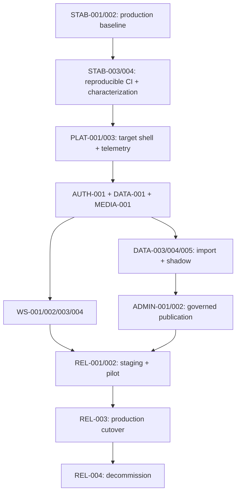

# Vibuco master implementation plan

Status: Proposed
Planning horizon: incremental slices, not a calendar commitment
Machine source: [implementation-work-items.yaml](../backlog/implementation-work-items.yaml)

## Outcome

Transform the existing prototype into the specified session-ready visual coaching workspace while keeping production deployable and preserving rollback. This plan implements the existing specification package. Product redesign decisions are not delegated to implementation agents.

## Milestones

| Milestone | Outcome | Exit gate |
| --- | --- | --- |
| M0 Stabilize | Existing production core route is observable and reliable | Seven-day stabilization SLO |
| M1 Baseline | Reproducible install/build, CI, characterization, pinned runtime | Clean CI from fresh clone |
| M2 Public foundation | App Router shell, design system, public pages, sample | WCAG/performance/SEO gates |
| M3 Secure workspace | Code-flow auth, entitlement, server content/media, full workspace | No browser AWS access |
| M4 Canonical content | PostgreSQL, import/reconcile, admin publication/rollback | Exact reconciliation and rights approval |
| M5 Production cutover | Flagged pilot, canary, target content path | SLO and product guardrails |
| M6 Decommission | Legacy routes/policies/data paths removed after rollback window | No residual dependency |

## Workstreams

| Workstream | Owner profile | High-conflict areas |
| --- | --- | --- |
| Stabilization/reliability | SRE/platform | deployment config, production env |
| Platform/build | Staff frontend/platform | `package.json`, lockfile, Next config, root layout |
| Design/public UX | Product frontend/design | tokens, shared components, public routes |
| Identity/security | Security/backend | auth config, middleware, cookies |
| Data/migration | Backend/data | Prisma schema, migrations, import |
| Media | Backend/platform | S3 policy, image DTOs, upload |
| Workspace | Product frontend | workspace state, grid, dialog, toolbar |
| Admin/content | Full-stack/content ops | admin routes, publication transactions |
| SEO/analytics | Growth/full-stack | metadata, routes, event schema |
| Quality/release | QA/platform | E2E, CI, environments, cutover |

## Critical path

## Parallelization

After the baseline lands:

- Public content/SEO can proceed beside server identity/data foundations.
- Design-system primitives can proceed beside telemetry and feature flags.
- Import tooling can proceed beside target workspace state logic after schema and DTO contracts land.
- Media ingestion can proceed beside card-admin forms after asset contracts land.
- E2E fixtures can proceed beside features after stable test IDs/contracts land.

Do not parallelize edits to the root layout, auth middleware, Prisma schema, OpenAPI, lockfile, global tokens, or CI workflow. Assign one owner and land contract changes first.

## Branch and merge plan

- Branch: `agent/<work-item-lowercase>-<short-slug>`.
- One work item per branch unless the TPM explicitly combines two inseparable items.
- Rebase on current `master` before final validation.
- Squash merge with commit prefix from the work item.
- Merge order follows dependencies in the YAML.
- Feature flags keep incomplete target paths unreachable in production.
- Delete branches after merge.

## Definition of Ready

A work item is ready when:

- all dependencies are `done`
- owner and likely files are assigned
- specification references resolve
- acceptance criteria are testable
- human decisions affecting the task are approved
- test fixtures/environment exist
- no unresolved high-conflict ownership exists

## Definition of Done

A work item is done when:

- all acceptance criteria pass
- code follows module and accessibility conventions
- required unit/integration/contract/E2E tests pass
- telemetry, security, privacy, and rollback requirements are implemented
- documentation/contracts/diagrams are updated
- clean build, type, lint, spec, security, and dependency checks pass
- handoff includes evidence and known limitations
- temporary flag/compatibility code has an owner and expiry task

## Quality gates

1. Contract gate: OpenAPI, Prisma, requirements, and DTOs agree.
2. Pull-request gate: required CI and review.
3. Staging gate: full critical matrix, migration rehearsal, accessibility, performance, security.
4. Pilot gate: cohort metrics no worse than legacy guardrails.
5. Launch gate: SLOs, rights, legal, rollback, runbooks, and budget approved.
6. Decommission gate: rollback window expired and residual dependency scan is empty.

## Release strategy

Public static routes may release independently after target gates. Authentication, content adapters, workspace, and database paths release behind server-evaluated flags. Pilot by explicit internal account cohort, then a small entitled cohort, then broader access. Deck content publication remains independently reversible.

Automatic application rollback triggers on critical synthetic failure, error-budget fast burn, authentication completion collapse, or invalid active-deck resolution. Manual rollback is always available.

## Risk controls

| Risk | Control |
| --- | --- |
| Long rewrite branch | Deployable route slices and two-day task sizing |
| Account lockout | Retain user pool, cohort flag, auth rollback |
| Content loss | Idempotent import, checksums, shadow reads, backups |
| Rights uncertainty | Publication-blocking rights state |
| Accessibility regression | Component gate plus E2E/manual matrix |
| Privacy leakage | Schema/event allowlists and redaction tests |
| Parallel conflict | File ownership and contract-first merges |
| Cost surprise | provider approval, budgets, cost dashboard |

Full register: [risk and debt register](../review/05-risk-and-debt-register.md).

## Rollback requirements

Every pull request affecting a route, auth, data, media, schema, feature flag, or publication must state:

- previous known-good artifact/path/version
- rollback command or control
- data compatibility after rollback
- user-visible consequence
- verification query/synthetic
- owner and maximum decision time

No destructive database contraction, identity deletion, policy revocation, or DynamoDB retirement during the rollback window.

## Launch gates

- `HUMAN-DECISION-001` through `005` resolved where applicable
- critical acceptance tests AT-001 through AT-035 pass
- no open critical/high security, privacy, rights, or accessibility defect
- production synthetic, dashboards, alerts, and runbooks verified
- database restore and application/auth/content rollback rehearsed
- public legal and accessibility pages approved
- all required locales editorially approved
- client bundle/network scan shows no direct AWS data access

## First executable sequence

Start with `VIB-STAB-001`, then `VIB-STAB-002`, `VIB-STAB-003`, and `VIB-STAB-004`. Do not begin the visual redesign before the production topology, core-route failure, reproducible baseline, and characterization suite are owned.
