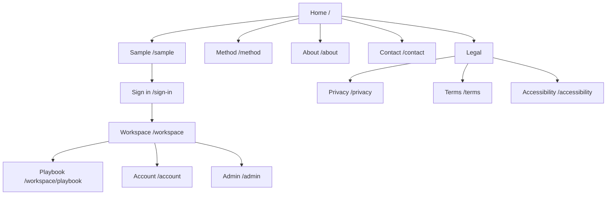

# Information architecture

## Sitemap

## Navigation model

Public header:

- Vibuco logo to home
- Try the cards
- How it works
- About
- Sign in

Authenticated header:

- Workspace
- Playbook
- Account
- Sign out
- Admin, only for authorized roles

The workspace uses a compact product bar, not the marketing header. The public footer contains product, support, and legal links. Newsletter promotion is removed.

## Route catalogue

| Route | Audience | Rendering | Responsibility | Primary action | Indexing |
| --- | --- | --- | --- | --- | --- |
| `/` | Public | Static/ISR | Explain audience, method, proof, and access | Try the cards | Index |
| `/sample` | Public | Server shell + client workspace | Ten-card guided sample | Reveal a card | Index |
| `/method` | Public | Static/ISR | Explain visual reflection and five patterns at a high level | Try sample | Index |
| `/about` | Public | Static/ISR | Founder, team, method provenance | Contact | Index |
| `/contact` | Public | Server | Validated support form | Send message | Index |
| `/privacy` | Public | Static | Controller, purposes, rights, retention | Contact privacy owner | Index |
| `/terms` | Public | Static | Product terms and limitations | Sign in | Index |
| `/accessibility` | Public | Static | Accessibility commitment and feedback | Report issue | Index |
| `/sign-in` | Public | Server | Start Cognito flow and explain access | Continue | Noindex |
| `/auth/callback` | Public utility | Server | Validate code/state and establish session | Redirect | Noindex |
| `/workspace` | Entitled | Dynamic server + client island | Full session-ready deck | Start preset | Noindex |
| `/workspace/playbook` | Entitled | Server | Detailed facilitator exercises | Open workspace | Noindex |
| `/account` | Signed-in | Dynamic server | Locale, access status, sign out, deletion request | Save preference | Noindex |
| `/admin` | Admin | Dynamic server | Content operations overview | Continue draft | Noindex |
| `/admin/cards` | Editor | Dynamic server | Card inventory and lifecycle | Create card | Noindex |
| `/admin/cards/[id]` | Editor | Dynamic server | Card, translations, asset, preview | Submit/Publish | Noindex |
| `/admin/decks/[id]` | Editor | Dynamic server | Membership, order, sample/full visibility | Publish version | Noindex |
| `/unavailable` | Any | Static | Planned maintenance/degraded state | Retry | Noindex |

Legacy route disposition:

| Legacy route | Target |
| --- | --- |
| `/cards` | 308 to `/sample` for anonymous users, `/workspace` for entitled users |
| `/instructions` | 308 to `/workspace/playbook` after auth |
| `/meetus` | 308 to `/about` |
| `/login`, `/register`, `/token` | 308 during migration, then 410 after search and traffic review |
| `/msg-success`, `/msg-notfound` | Replace with inline states and standard 404 |

## Page contracts

### Home

Order: outcome-led hero, interactive sample preview, three-step method, use cases, credible testimonials, access explanation, founder trust, final action. Avoid generic feature grids and repeated testimonials.

### Sample

Order: short instruction, preset choice, card toolbar, grid, focused-card dialog, completion next step. A persistent disclosure states that the sample does not record responses.

### Workspace

Order: product bar, session status, preset/locale controls, card grid or focused presentation, recovery messages. Marketing content is absent.

### Admin

Order: status and validation summary, editable content, preview, workflow actions, audit history. Destructive and publishing actions require explicit confirmation.

## URL and locale policy

English remains the marketing source locale for v1. Card prompt locale is a workspace preference and does not create duplicate crawlable URLs. If localized marketing pages are approved later, use explicit locale prefixes and `hreflang`. Slugs are lowercase ASCII, stable, and never include database IDs on public pages.
